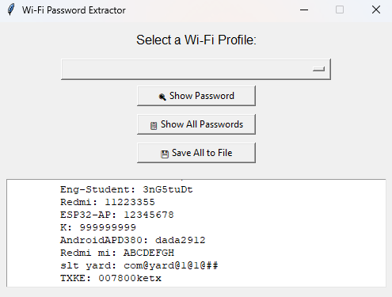

# 🔐 Wi-Fi Password Extractor (Windows) – GUI Version

A lightweight Python desktop application that allows you to view and save all saved Wi-Fi passwords on your Windows system through a simple and intuitive GUI.

## ✅ Features

- 🔍 View all saved Wi-Fi profiles
- 🔑 Display the password for a selected network
- 📋 Show all saved Wi-Fi passwords at once
- 💾 Save all retrieved passwords to a `.txt` file
- 🧩 Single-file Python script (no external dependencies except standard libraries)
- 🛡️ No admin rights required (only shows passwords for accessible profiles)

## 🛠️ Built With

- Python 3
- [`tkinter`](https://docs.python.org/3/library/tkinter.html) – GUI interface
- `subprocess`, `re` – For system command execution and output parsing

## 📌 Requirements

- Windows OS
- Python 3.x installed and added to PATH

## 🚀 How to Run

1. Clone this repository or download the script file.
2. Open your terminal or command prompt.
3. Run the script using:

```bash
python wifi_password_gui.py
```

## 📸 Screenshot



